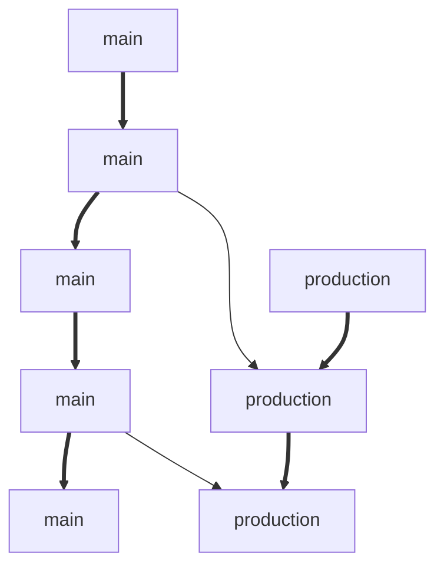

# github-action-practice

## 프로젝트 소개
이 프로젝트는 Github Action과 git branch workflow를 연습하기 위한 프로젝트입니다.

### 브랜칭 전략
main 브랜치와 production 브랜치를 사용합니다.
* main: 최신 소스
* prodction: 운영 환경에 배포된 소스 (배포 시점의 main/HEAD를 병합)

브랜칭 전략은 다음과 같습니다.  
main: feature -> main PR by rebase만 가능. main에 직접 push 불가  
production: main -> production PR by merge만 가능. production에 직접 push 불가  

### CI
github action을 통해 아래와 같은 작업을 수행합니다.
* feature -> main PR by rebase: test workflow가 수행됩니다. gradle test를 통해 test용 application.yml을 사용해 테스트합니다.
* 위 테스트 통과 시 feature->main PR이 승인됩니다. PR merge close 시, workflow가 수행됩니다. gradle build를 수행합니다.
* 배포 시점에 main/HEAD -> production PR by merge. 승인이 되면 gradle build 후 aws에 배포합니다. (아래 CD참조)

### CD
production 브랜치의 최신 소스를 aws EC2 ubuntu 서버에 배포합니다.

* main/HEAD -> production PR 승인 후, PUSH가 발생하면 배포 workflow가 수행됩니다.
* S3와 CodeDeploy를 통해 EC2 Ubuntu 환경에 jar를 배포하고 실행합니다.
* DB는 RDS mysql을 사용합니다.

### 특이사항
* gradle의 resources set 분리를 통해 prod 환경의 resources만 jar에 포함합니다.
* DB 연결 정보와 같은 내용은 EC2 ubuntu의 환경변수로 설정하고 이를 application.yml이 가져다 쓰도록 합니다.
* aws 연결 정보는 github action의 secret key를 사용하여, 해당 정보를 workflow.yml에 노출되지 않도록 합니다.
* EC2에 jar 배포 후, script를 실행하여 현재 구동중인 app이 있으면 종료하고 재기동 합니다.

### 느낀점 및 개선점
* main과 prodcution 브랜치를 나누어 운용할 필요가 없다.   
(환경별 빌드 아티팩트를 다르게 가져갈 이유가 없고, github action의 기능을 통해 다르게 가져가야할 정보들을 동일한 파일 이름으로 내용만 바꾸어 사용 가능) 
* EC2에 환경변수에 DB 연결정보를 직접 등록해서 사용하지 않고, github action secret 기능을 통해 yml에 연결정보를 넣도록 할 것
* main 브랜치에서 PR by merge -no-ff가 아니라 PR by rebase를 한 이유
(feature의 작업 내용이 원자적으로 잘 분할되었을 경우에는 하나의 commit을 가지게 될 것이고, 따라서 1PR-1feature-1commit이 가능하므로 main 브랜치에서의 1commit이 1feature 브랜치가 되므로 feature의 merge 기록을 나누기 위해 -no-ff 방식으로 PR을 하여 메인 브랜치의 트리를 복잡하게 할 필요가 전혀 없다고 느낌)
